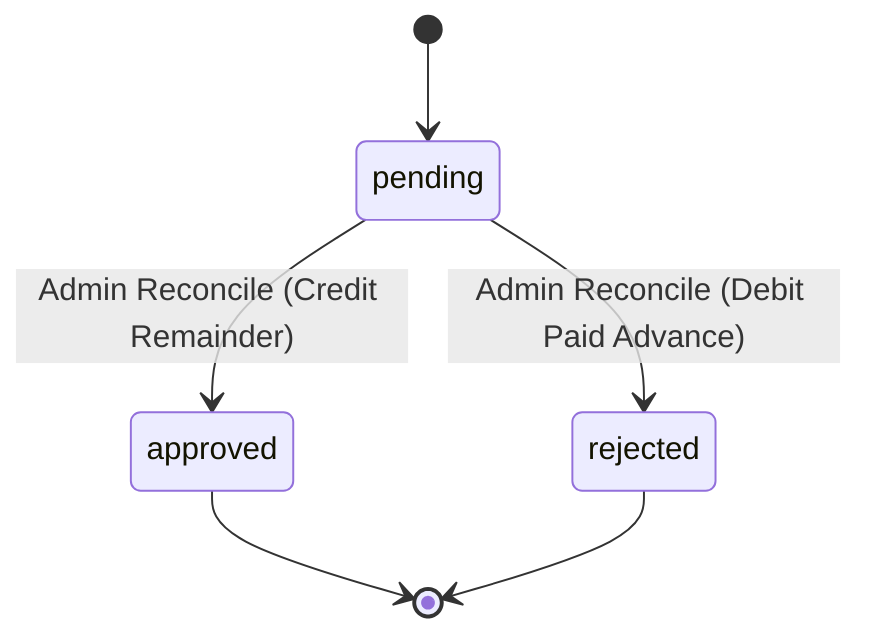
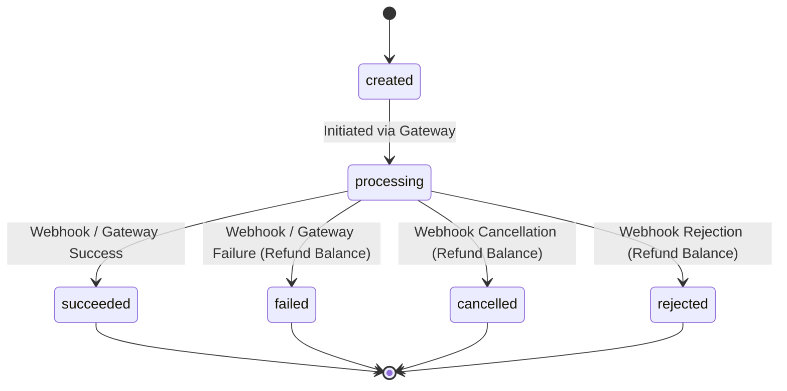
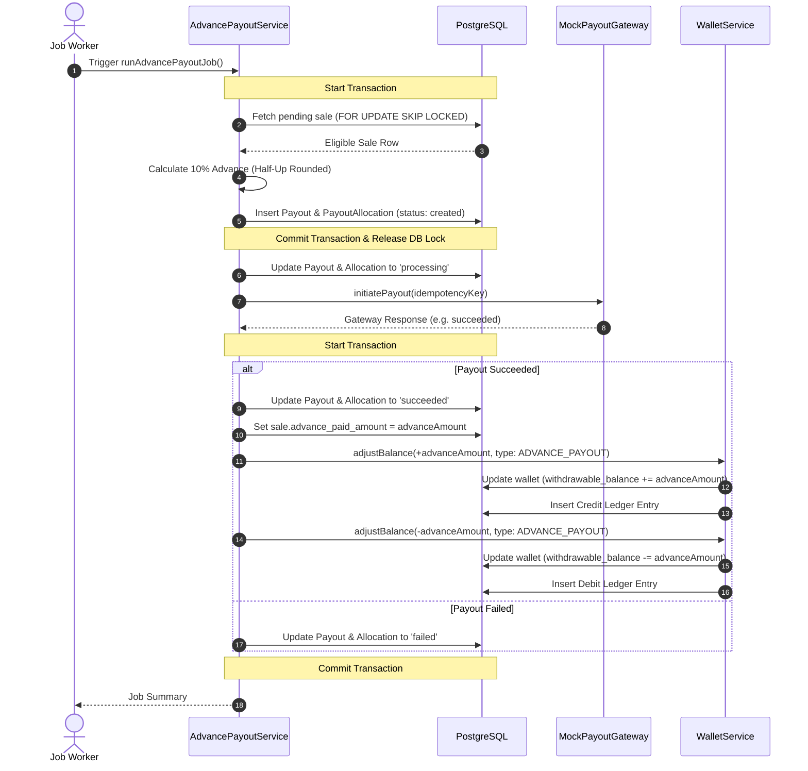
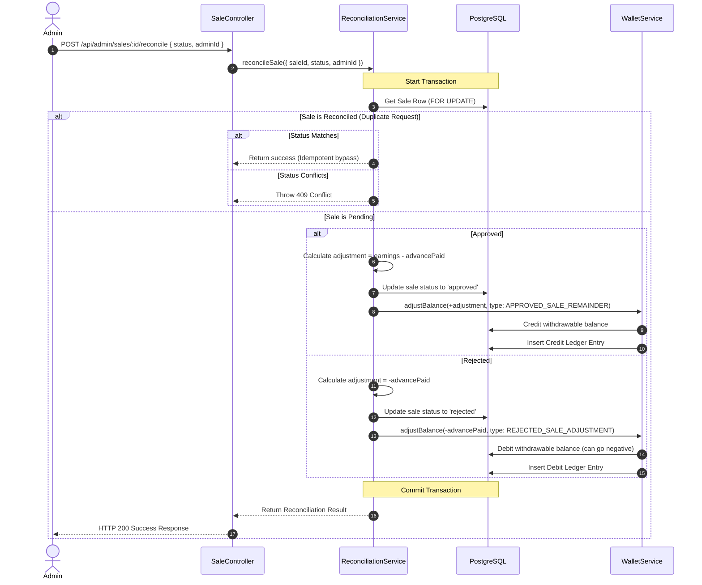
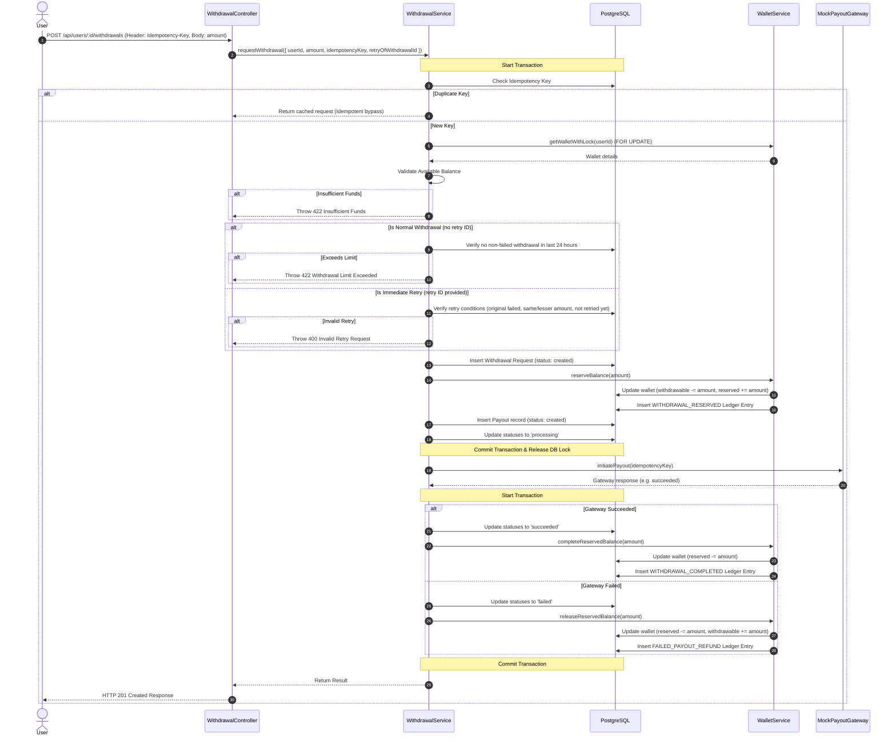
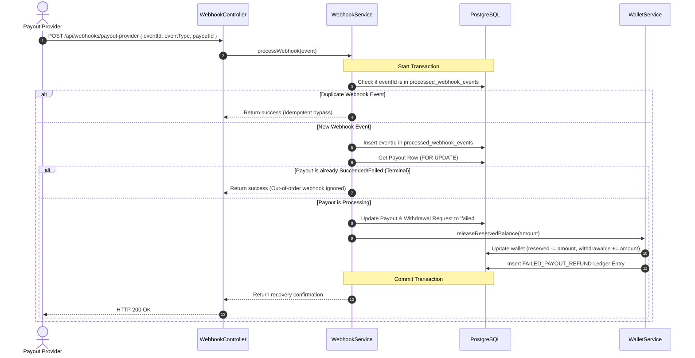
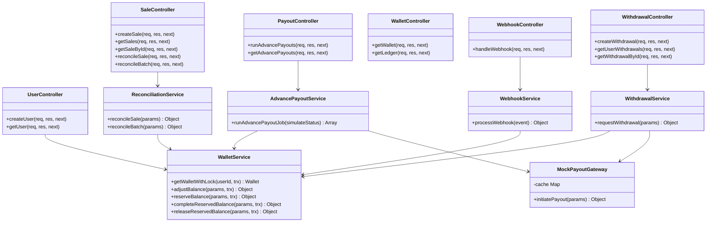

# Low-Level Design (LLD) - User Payout Management System

This document provides a comprehensive Low-Level Design for the Affiliate Sale Payout Management System.

---

## 1. System Components & Responsibilities

The system is designed using a clean, layered architecture:

- **Controllers**: Parse requests, execute basic HTTP validation, delegate domain actions to services, and map service results to HTTP responses.
- **Routes**: Mount REST API routes and apply middleware.
- **Validation Middleware**: Intercepts requests to validate parameter types, structural integrity, and presence of mandatory headers (e.g. `Idempotency-Key`).
- **Services (Domain Logic)**:
  - `WalletService`: Performs atomic withdrawable/reserved balance operations, checks funds, locks wallet rows, and inserts immutable ledger entries.
  - `AdvancePayoutService`: Coordinates automatic 10% advance commissions for eligible pending sales. Uses row-level locks to support safe concurrent worker execution.
  - `ReconciliationService`: Allows administrators to reconcile sales, calculating remainder adjustments or debt collections.
  - `WithdrawalService`: Directs manual user withdrawal requests, validating available balances and enforcing the 24-hour frequency limit and retry exceptions.
  - `WebhookService`: Integrates callback status updates from the payment provider to finalize payouts or recover failed funds.
- **MockPayoutGateway**: Simulates payout provider processing, timeout delays, and error states while maintaining an in-memory idempotency cache.
- **Database Layer**: Knex schema configurations, foreign keys, row locks, partial unique indexes, and audit ledgers.

---

## 2. Status Machines

### Sale Status State Machine

### Payout Status State Machine

---

## 3. Data Flow Sequences

### Sequence 1: Advance Payout Workflow

### Sequence 2: Reconciliation Workflow

### Sequence 3: User Withdrawal Workflow

### Sequence 4: Failed Payout Webhook Recovery

---

## 4. Class Design Diagram

This diagram displays the service abstractions and their relations:

---

## 5. Concurrency & Idempotency Controls

1. **Row-Level Locking**: Database updates impacting user wallets are wrapped in transactions and lock the matching row via `FOR UPDATE`. This blocks concurrent operations (e.g. multiple concurrent withdrawals or webhook executions) from creating race conditions.
2. **Worker Concurrency**: The advance payout job locks pending sale rows using `FOR UPDATE SKIP LOCKED`. If two worker threads execute simultaneously, they process disjoint sales without collision.
3. **Idempotency Keys**:
   - Webhook events: Checked and stored in `processed_webhook_events` (primary unique key is `provider_event_id`).
   - User withdrawals: Guarded by a unique index on `idempotency_key` in the `withdrawal_requests` table.
   - Balance adjustments: The ledger entries enforce uniqueness on `idempotency_key` (constructed deterministically: e.g. `reconcile_sale_<id>_status_<status>`), making duplicate updates mathematically impossible.
